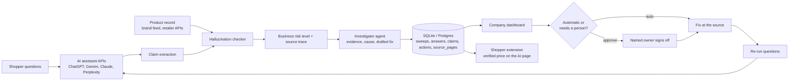

# SimplyShop: Trustworthy AI Product Discovery

University of Houston submission for the 2026 HSI Battle of the Brains.

Full site (shopper side and company side): https://simplyshop-uh.lovable.app

Company dashboard on its own: https://kjscoding.github.io/UH_TECH_09302026/

Start here if you are evaluating the technical implementation: the `monitor/` folder. It is the backend: it asks the AI assistants, checks every answer for hallucinations, traces the source, scores the harm, routes fixes through governance, and writes it all to a database. The dashboard sits on top.

What is real and what is simulated: demo mode uses reproducible sample AI responses so judges do not need API keys. The claim checker, hallucination detection, source tracing, severity scoring, governance routing, database, and every metric run for real on that sample, in both the backend and the dashboard. Add one API key and `--live` to collect real answers. The hosted dashboard demonstrates the full workflow on its own embedded copy of the sample data and a JavaScript port of the checker; the Python backend produces the same data model and the two are kept in sync by hand (same numbers: 48% inclusion, 79% accuracy, 13 hallucinations, 7 critical or high risk). Wiring the dashboard to read the database directly is the next step. Dell prices, competitor names, and the shopper insights, returns, tickets and trust figures are sample data.

## Architecture



The loop is the product: AI answer, wrong claim, truth comparison, likely source, harm score, controlled fix, human approval when needed, re-run, measured improvement.

## What it does

Shoppers now ask AI assistants "what's the best laptop under $500?" and buy from the short answer they get back. If the assistant leaves a brand out, or gets its price, specs, stock or return policy wrong, the brand loses the sale or eats the return. SimplyShop gives a company a control room for that new front door.

1. Visibility Monitor: asks a library of real shopper questions across AI assistants (the demo models five: ChatGPT, Gemini, Perplexity, Claude and Copilot; live collection is implemented for ChatGPT, Gemini, Claude and Perplexity, and more assistants plug in through the same adapter interface), then scores whether the brand appears, at what position, and next to which competitors.
2. Hallucination Watch: splits every AI answer into individual claims and checks each one against the company's product record. Catches incorrect pricing, availability, features and policies, plus fabricated products (retired or never existed) and misleading comparisons against them. Each one gets a business risk level on the company's own scale (see Risk model below) and is matched to the likely cited source of the incorrect claim.
3. Source Tracing: matches each wrong fact to the likely cited source of the incorrect claim (a stale retailer listing, an old review, an archived spec sheet) by checking which cited page's snapshot contains the same wrong value. It does not claim to know what trained the model; it finds the most plausible cited origin so the team fixes the cause, not the symptom.
4. Investigator agent and Approvals: for every hallucination, an agent looks up the approved fact, checks each cited source for the wrong value, names the likely cause, and drafts the correction (a correction request to a retailer, a resync of the brand's own feed, a policy FAQ line, or a lineup page for retired models). It writes a case file with evidence, confidence and a recommendation, and hands it to the accountable owner. The agent drafts, a person publishes: only a resync of an already approved price or stock value on the brand's own feed runs automatically. In demo mode a rule based driver runs the agent's tools; with `--agent-llm` and an Anthropic or OpenAI key, an LLM drives the same tools and writes the draft wording. Both drivers can only draft, never send.
5. Fix Engine and Approvals: scores each error for customer harm and routes it. Safe fixes that only copy an already approved fact (like resyncing the brand's own product feed) are marked automatic and moved to done; in production that action connects to the brand's product information system. Anything that publishes new copy, contacts an outside company, or touches policy wording waits for a named owner to approve.
6. Change Impact: logs every change the company makes (page updates, price changes, retailer corrections) and shows whether inclusion and accuracy went up or down after it.
7. Shopper Insights: from opt in SimplyShop extension users, totals only. Why shoppers picked a competitor, head to head win rates, top questions and budgets.
8. Business Impact: returns and support tickets matched to each live hallucination (product, reason and date), the estimated weekly cost, money saved as they get fixed, shopper trust, and partner deal conversion.
9. This week's plan: fixes grouped by root cause and ordered by weekly payoff, with owner, effort and the agent's draft, so one stale page feeding three hallucinations is one job. Every hallucination card carries its fix, owner, effort, playbook and weekly savings. Governance holds the playbook per risk category and preventive recommendations (structured data, retired lineup page, hourly feed sync, one canonical policy page) drawn from the sweep's patterns. `run_sweep.py` prints the same plan.
10. Alerts: level 4 and 5 risks (money involved) go straight to the owner; the rest roll into a weekly digest.
11. Audit and Governance: every action is logged with who took it and why. Owners, action tiers and scale controls are laid out in the Governance view.

## How to use the demo

The demo loads a real sponsor brand, Dell, with sample product data and placeholder competitors. Assistant answers are simulated sample runs so judges can use it without API keys. The claim checker, source tracing, business risk scoring, routing rules and metrics all run live in the browser.

Click "Guide me through" at the top of the dashboard for a 12 step walkthrough (or open the dashboard link with #tour). Suggested path if you would rather click around (about 3 minutes):

1. Overview: see inclusion, fact accuracy, wrong facts live and average position.
2. Visibility: click any cell to read that assistant's answer with each claim highlighted green (correct) or red (wrong).
3. Hallucination Watch: every hallucination by kind, with its risk level and why, likely origin, and the routed action.
4. Sources: which pages are causing the most wrong facts.
5. Approvals: approve or reject fixes and content gaps as the accountable owner.
6. Click "Re-run all questions" at the top. In demo mode this re-runs the saved sample answers (no network call), with approved fixes swapped in, so the metrics and trend chart update. The live collector is `monitor/run_sweep.py --live`.
7. Try it: paste any AI answer about a Dell product and the checker grades it claim by claim.


## The monitor: how the data actually gets collected

The `monitor/` folder is a small, working version of the backend. It is what runs on a schedule in production. No framework, no install, Python 3 only.

```
cd monitor
python3 test_checker.py     # 15 tests: claims, hallucinations, tracing, price parsing, database, investigator agent
python3 run_sweep.py        # demo mode, no API keys needed
python3 query_db.py         # read the results back from the database
python3 run_sweep.py --live # asks the real assistants (set OPENAI_API_KEY, GOOGLE_API_KEY, ANTHROPIC_API_KEY or PERPLEXITY_API_KEY)
python3 run_sweep.py --agent-llm  # let an LLM drive the investigator agent (ANTHROPIC_API_KEY or OPENAI_API_KEY)
```

Expected test output:

```
ok  test_correct_price_and_specs
ok  test_wrong_price_is_flagged
ok  test_budget_is_not_a_price_claim
ok  test_competitor_numbers_are_not_credited_to_us
ok  test_missing_touchscreen_is_caught
ok  test_policy_without_product_name
ok  test_rank_and_severity
ok  test_risk_direction_and_profile
ok  test_linked_returns_escalate_risk
ok  test_company_profile_changes_levels
ok  test_structured_price_parser
ok  test_fabricated_and_retired_products
ok  test_misleading_comparison_against_retired_product
ok  test_real_products_are_not_flagged_as_fabricated
ok  test_database_round_trip
ok  test_agent_drafts_correction_and_needs_approval
ok  test_agent_marks_brand_feed_resync_automatic
ok  test_agent_never_auto_publishes_policy_or_content
18 tests passed
```

Expected sweep output (demo mode):

```
SimplyShop sweep for Dell  (40 answers, 62 claims checked)
  Inclusion in shopping answers: 48%
  Fact accuracy:                 79%
  Hallucinations live:           13  (7 critical or high risk)

  Business risk (company profile, 5 = losing money now):
    level 5 critical  6
    level 4 high      1
    level 3 moderate  5
    level 1 minimal   1
  By category: bad data 4, reputation 4, losing money 3, money at risk 2
  ...
  Investigator agent (rules): 13 case files, 12 waiting on a person, 1 automatic
  ...
Saved sweep #1 to simplyshop.db (tables: sweeps, answers, claims, actions, case_files, source_pages)
```

What one sweep does:

1. Asks each AI assistant every question in `data/questions.json` through its official API (`simplyshop/assistants.py`): OpenAI, Google, Anthropic and Perplexity today. Copilot has no public API, so it appears in the demo data only. Adding an assistant is one adapter function. No scraping of chat sites. Perplexity returns the pages it used, which powers Source Tracing.
2. Splits each answer into claims and checks them against the brand's product record in `data/products.json` (`simplyshop/checker.py`). Wrong prices, specs, stock, features and policies are flagged, scored for business risk, and matched to the likely cited source (the cited page whose snapshot contains the same wrong value).
3. Saves everything to a SQLite database, `monitor/simplyshop.db` (tables: sweeps, answers, claims, actions, case_files, source_pages), plus a JSON copy in `output/`. `python3 query_db.py` shows the latest sweep from SQL, `--export` writes the JSON the dashboard reads, and `--sql "..."` runs any query. Any SQLite viewer opens the file. Swapping to Postgres is one connection line.

Demo mode uses `data/sample_answers.json`, so judges can run it with zero keys and get the same numbers the dashboard shows (48% inclusion, 79% accuracy, 13 hallucinations, 7 critical or high risk).

Where the real prices come from (`simplyshop/prices.py`), most reliable first: the brand's own product feed, then retailer and affiliate APIs, and only then reading a public product page. For pages we read the structured product data (schema.org JSON) rather than scraping HTML, check robots.txt first, keep a slow rate, and never go behind a login.

Production layout: these scripts run on a scheduler (cron or GitHub Actions) a few times a day, write to a Postgres database, and the dashboard reads from it. An LLM extracts claims from messier answers and this rule based checker validates them.

## How this answers the case prompt

| The prompt asks | Where it is answered |
|---|---|
| Track whether products or the brand show up in AI answers | Dashboard: Overview and Visibility tabs. Backend: `monitor/run_sweep.py`, `answers` table (brand_rank column) |
| What information the AI seems to rely on | Dashboard: Sources tab. Backend: source tracing in `checker.py`, `source_pages` table |
| Whether updates to the site, product pages, pricing or reviews help or hurt | Dashboard: Change Impact tab (before and after every change, live rows added when fixes are approved and questions re-run) |
| Detect incorrect or misleading information (features, pricing, availability, policies, comparisons) | Dashboard: Hallucination Watch tab, grouped by kind in the prompt's own words. Backend: `checker.py` (`HALLUCINATION_KIND`), `claims` table |
| Hallucinations about products that do not exist | Fabricated product and misleading comparison detection (`_phantoms` in `checker.py`), retired products in `data/products.json` |
| Measure the impact of those failures (returns, support costs, trust) | Dashboard: Business Impact tab, returns and tickets matched per hallucination, cost model, shopper trust rating |
| Use AI where it adds clear value | The investigator agent (`monitor/simplyshop/agent.py`): per hallucination it gathers evidence, names the cause and drafts the fix for a person to approve. Plus automated question runs across the assistants, claim checking and business risk scoring; an LLM extracts claims in production and the deterministic checker validates them |
| Which actions are automatic vs. need a person, and who is accountable | Dashboard: Approvals tab (every item carries the agent's brief and a drafted correction) and Governance tab. Backend: `route()` in `db.py`, `actions` and `case_files` tables (mode, owner, status, decided_by, requires_approval). The agent can draft but cannot publish, resync or contact anyone |
| Keep oversight working at scale | Governance tab: risk routing (people are paged only for level 4 and 5), monthly checker accuracy test, 5% spot checks, one adapter per assistant, per team views |
| Ethics: no unfair recommendations, privacy | Partners can never buy rank; every partner deal labeled; sharing off by default; Global Privacy Control honored; what the brand can and cannot see (Governance tab, shopper site Privacy Center) |
| Show improved inclusion, conversion and trust | Overview scorecard and trend chart; approve fixes, re-run, watch the numbers move; extension conversion and trust figures |

How this differs from AI visibility monitoring tools (Profound and similar): those stop at telling marketing what the AI said. SimplyShop closes the loop: it traces the wrong claim to its source, scores the harm in returns and tickets, routes the fix through named owners, re-runs the questions and proves the fix worked, and corrects the answer for the shopper at the moment of purchase through the extension.

What is real in this repo and what is simulated: the checker, source tracing, risk scoring, routing rules, database and metrics all run for real, on both the backend and in the dashboard. The AI answers, Dell prices, competitor names, and the shopper insights, returns, tickets and trust figures are sample data so judges can use everything without API keys or Dell's private data. Run `python3 run_sweep.py --live` with an API key to collect real answers.

## Tech

1. Plain HTML, CSS and JavaScript in one page (`src/app.html`), no framework and no build tools, so it hosts anywhere for free.
2. Claim extraction: rule based parser tuned to product facts (prices, specs, stock words, policy terms), with competitor clauses stripped so their numbers are never credited to the brand.
3. Source tracing: matches the wrong value against a snapshot of each cited page.
4. Risk model: see below. Same rules in `src/app.html` and `monitor/simplyshop/checker.py`.
5. Hosted on GitHub Pages.

## Risk model

Severity is not how wrong the fact is, it is what the wrong fact costs the company. Every company measures that differently, so the levels come from a per company profile (`monitor/data/products.json`, `risk_profile`; the dashboard's copy is the `RISK` constant). Dell's defaults:

| Category | Level | Means | Examples |
|---|---|---|---|
| Losing money | 5 Critical | Money is leaving right now | Price quoted below what Dell charges, "in stock" on a backordered product, a return or warranty promise longer than the real policy, any wrong fact with 5 or more returns already linked to it |
| Money at risk | 4 High | Money involved, not yet lost | Price quoted above what Dell charges, "sold out" on a product that is in stock, a policy understated so shoppers buy elsewhere |
| Bad data | 3 Moderate | Wrong spec, no direct sale attached | Wrong RAM, storage, battery or touchscreen |
| Reputation | 3 Moderate | Nothing to buy at the end | A retired or made up Dell product recommended or compared as current |

Direction matters: the same wrong price is level 5 if it is too low (shoppers abandon at checkout or demand a price match) and level 4 if it is too high (shoppers rule Dell out). Adjustments: bad data drops one level on informational questions and one more on low reach assistants, which is the only way to reach level 2 (Low: doable, little harm) or level 1 (Minimal: no reputation harm, nobody buying). Reputation never drops. Evidence from the company's returns and support systems (`monitor/data/linked_harm.json` in the demo) can only raise a level: 5 or more linked returns in 30 days means money is leaving, straight to level 5; any return or 30 or more tickets moves it up one. A retailer like Home Depot would keep losing money at 5 and might set reputation to 4; that is a two line change in the profile, covered by `test_company_profile_changes_levels`.

Production path: the same checker sits behind a scheduled job that calls each assistant's API, stores answers and claims in a database, and uses an LLM to extract claims from free form answers, with this rule based checker kept as a validator. See the Governance view for the controls that keep it trustworthy as it scales.

## How to run it

Easiest: open the live demo link above. Nothing to install.

Locally (needs bash and python3):

```
./run.sh
```

Then open http://localhost:8080. `run.sh` builds `index.html` from `src/app.html`, starts a local server and checks that the app responds.

## Files

1. `src/app.html`: the dashboard (markup, styles, data and engine)
2. `monitor/`: the backend (ask the AIs, check for hallucinations, trace the sources, write to SQLite) with tests and demo data
2. `build.sh`: wraps the app into `index.html`
3. `index.html`: the built page GitHub Pages serves
4. `run.sh`: build and serve locally

## Team

University of Houston, HSI Battle of the Brains 2026.
